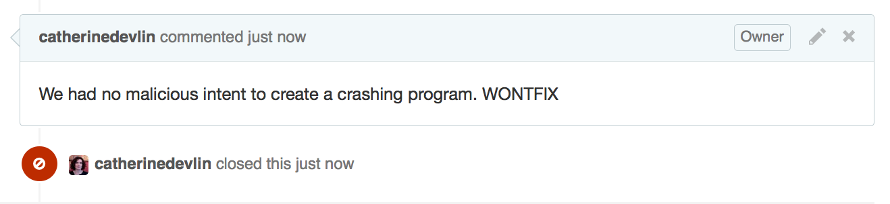
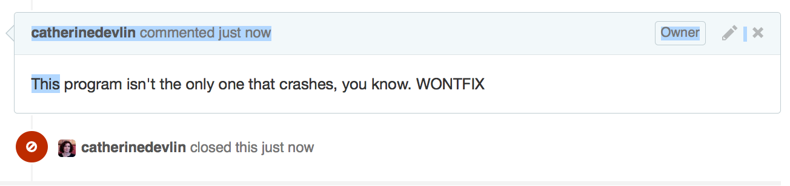

# Open Source Society

## Catherine Devlin

## PyOhio 2015

---

# c'est moi

- Chem eng, DBA (1999), Pythonista (2004?)
- Minnesotan expat in Dayton
- PyOhio chair 2008, 2009

---

# 18F: Your tax dollars at work!

CM, Shahank, Adam, Yuda, Christine, Theresa, Yoz, and more...

## Also: US Digital Service

---

# Premise

FOSS will change the world.

Software will be the least important
part of this change.

---

# Handbasket

---

Source: [The Economist](http://www.economist.com/blogs/graphicdetail/2012/02/daily-chart-20)

---

# Scale

- Bands ([Dunbar's Number](https://en.wikipedia.org/wiki/Dunbar%27s_number) ~ 150)
- Tribes
- Kingdoms
- States
- World

---

Yung-Yu Chen, PyCon Taiwan

---

- Hierarchy
- Regulations
- Marketplace

Corporations, organizations, ...

---

> [O]utside the ordered universe [is] that amorphous blight of nethermost confusion which blasphemes and bubbles at the center of all infinity—the boundless daemon sultan Azathoth, whose name no lips dare speak aloud, and who gnaws hungrily in inconceivable, unlighted chambers beyond time and space amidst the muffled, maddening beating of vile drums and the thin monotonous whine of accursed flutes.

> - H. P. Lovecraft, "The Dream-Quest of Unknown Kadath", in At The Mountains of Madness

---

---

---

---

# Revolutions

* Agricultural
* Industrial
* Information

---

---

* More industries
* Society's structure
* Mind

---

# Laboratory of cooperation

- Tools
- Techniques
- Attitudes

---

# Caveats

* Information technology
* Open-source
* Agille development

---

# More Caveats

- Idealized FOSS
- Not new

> δωρεὰν ἐλάβετε, δωρεὰν δότε.

---

# Tour the Laboratory

---

1. **Non-ownership** <<<
2. Humility
3. Soft Boundaries
4. Critique
5. Diversity
6. Growth
7. Interfaces
8. Encapsulation

---

## Ownership

- Secrecy

- Legal control

- Prosperity

---

## Credibility

---

## Openness can bring...

- Commercial success
- Trust

---

## Tools of Non-ownership

- Version control
- GitHub

---

[prose.io](http://prose.io)

[Music to recipes](http://readwrite.com/2013/11/08/seven-ways-to-use-github-that-arent-coding)

---

## Closedness in government

[PublicResource.org](http://www.abajournal.com/magazine/article/who_owns_the_law_technology_reignites_the_war_over_just_how_public_document)

---

## Openness in government

[18F Open Source Policy](https://github.com/18F/open-source-policy/blob/master/policy.md)

[USDS Playbook: Default to Open](https://playbook.cio.gov/)

---

[data.gov](http://www.data.gov/)

FOIA [Release to One, Release to All](http://www.pogo.org/blog/2015/07/foia-release-one-to-all.html?referrer=https://www.google.com/)

---

1. Non-ownership
2. **Humility** <<<
3. Soft Boundaries
4. Critique
5. Diversity
6. Growth
7. Interfaces
8. Encapsulation

---

## Optics

- Emotion

- Salesmanship

- Beyond business  

---

## Humility

- No sweeping under rug

- Seek & acknowledge help

- MVP

- Fail fast

- Iterate: humility about future

---

## [PyOhio 2008](https://mail.python.org/pipermail/centraloh/2008-March/000082.html)

- public library
- bare-bones
- appeal for help

---

1. Non-ownership
2. Humility
3. **Soft Boundaries** <<<
4. Critique
5. Diversity
6. Growth
7. Interfaces
8. Encapsulation

---

## Opposite of

- Insiders / outsiders

- [Groupthink](http://www.psysr.org/about/pubs_resources/groupthink%20overview.htm)

- Hoarding credit

- Not-invented-here

---

1. Non-ownership
2. Humility
3. Soft Boundaries
4. **Critique** <<<
5. Diversity
6. Growth
7. Interfaces
8. Encapsulation

---

## Defensiveness

Fear of discrediting

- Emotional

- Economic

---

## Critique is cooperation

- Code review

- Bug reports

- Tests

Part of iteration

---

## Personal

---

1. Non-ownership
2. Humility
3. Soft Boundaries
4. Critique
5. **Diversity** <<<
6. Growth
7. Interfaces
8. Encapsulation

---

## Unicorn Law

> If you are a woman in Open Source, you will eventually give a talk about being a woman in Open Source.

> - Emma Jane Hogbin, Gabrielle Roth

---

## Critique

---

## Rich test suite

  $ ls tests/diversity/
  test_age.py     		test_gsm.py
  test_background.py	test_immigrant.py
  test_disability.py	test_racial.py
  test_gender.py   		test_religion.py

---

Location, location, location

---

---

# Nóirín Plunkett, July 29, 2015

- Apache httpd contributor, board member
- Documentation, conference organization
- Digital Rights Ireland
- Ada Initiative

---

1. Non-ownership
2. Humility
3. Soft Boundaries
4. Critique
5. Diversity
6. **Growth** <<<
7. Interfaces
8. Encapsulation

---

## Gatekeeping

[Source](https://www.flickr.com/photos/tylerbolken/13384711585/in/photolist-moLNZz-moLBqn-moLh1T-moL4XK-moLH96-moL9rp-moLwtt-moNaBf-moMM5w-moM2yc-6ncaez-97qsCn-97qq9D-5DCbzi-cn4Zhq-moLebV-moNcyS-axW9cA-nGJkff-axTrNK-axTsvB-axTrVa-9CdiAh-9ozQrj-9h6wJE-ofVmzu-8vEXwC-cn4YmW-9h6wkq-9sMWfM-9Gte88-9h6wFE-8qPEKE-9k6zaz-5DBByk-9k9PUj-9k6Kd6-9k6JUV-9bex21)

---

## Skill Hoarding

- Weeder courses

- Hazing

- Jargon

---

## Growth == richness

---

## Valuing beginners

Smooth the on-ramps!

---

- Organizations
- Documentation
- [Courses](https://wiki.python.org/moin/BeginnersGuide)
- Tools: [Try Jupyter](https://try.jupyter.org/)

---

1. Non-ownership
2. Humility
3. Soft Boundaries
4. Critique
5. Diversity
6. Growth
7. **Interfaces** <<<
8. Encapsulation

---

## Proprietary over-scoping

Big Promises == Big Sales

No need for interfaces!

---

## Small sharp Tools

... that *interface well*

- No control
- No prediction

    history | awk '{a[$2]++}END{for(i in a)
      {print a[i] " " i}}' | sort -rn | head

[source](http://www.commandlinefu.com/commands/view/604/list-of-commands-you-use-most-often#comment)

---

API Design

Documentation

  - Markdown, ReStructured Text
  - Sphinx

---

## data.gov

## [OpenFEC](https://api.open.fec.gov/developers)

---

## Small sharp *teams*

- Interoperating
- Standards
- Openness
- Humility

---

## Traditional Governance

- Hierarchy
- Regulations
- Marketplace
- Mad amoebic demon-gods

---

## Interfacey Governance

- Distributed
- Level
- Human
- Fail fast
- Vote with feet

---

1. Non-ownership
2. Humility
3. Soft Boundaries
4. Critique
5. Diversity
6. Growth
7. Interfaces
8. **Encapsulation** <<<

---

> “In the event that the Tenant shall fail to make the payment of rent when due or shall fail to perform in accordance with the covenants and conditions herein set forth, said sum shall be retained by the Landlord and applied towards Landlord’s damages resulting from Tenant’s default.”  [source]( http://www.themckenziefirm.com/incomprehensible-legal-documents/#sthash.sNOH0t0u.dpuf)

Industrialization failed to update it!

---

> Redistribution and use in source and binary forms, with or without modification, are permitted provided that the following conditions are met:

> 1. Redistributions of source code must retain the above copyright notice, this list of conditions and the following disclaimer.

> 2. Redistributions in binary form must reproduce the above copyright notice, this list of conditions and the following disclaimer in the documentation and/or other materials provided with the distribution.

> 3. Neither the name of the copyright holder nor the names of its contributors may be used to endorse or promote products derived from this software without specific prior written permission.

> THIS SOFTWARE IS PROVIDED BY THE COPYRIGHT HOLDERS AND CONTRIBUTORS "AS IS" AND ANY EXPRESS OR IMPLIED WARRANTIES, INCLUDING, BUT NOT LIMITED TO, THE IMPLIED WARRANTIES OF MERCHANTABILITY AND FITNESS FOR A PARTICULAR PURPOSE ARE DISCLAIMED. IN NO EVENT SHALL THE COPYRIGHT HOLDER OR CONTRIBUTORS BE LIABLE FOR ANY DIRECT, INDIRECT, INCIDENTAL, SPECIAL, EXEMPLARY, OR CONSEQUENTIAL DAMAGES (INCLUDING, BUT NOT LIMITED TO, PROCUREMENT OF SUBSTITUTE GOODS OR SERVICES; LOSS OF USE, DATA, OR PROFITS; OR BUSINESS INTERRUPTION) HOWEVER CAUSED AND ON ANY THEORY OF LIABILITY, WHETHER IN CONTRACT, STRICT LIABILITY, OR TORT (INCLUDING NEGLIGENCE OR OTHERWISE) ARISING IN ANY WAY OUT OF THE USE OF THIS SOFTWARE, EVEN IF ADVISED OF THE POSSIBILITY OF SUCH DAMAGE.

Medieval - on the inside!

---

## Encapsulation

## Standardization

---

## Imagine...

[modern clarity](http://www.consumerfinance.gov/eregulations/1005-10/2014-20681#1005-10-a)

---

> Governing law: BSD Nonprofit Tax Code v3.0

---

[Free Law movement](https://www.civicquarterly.com/article/defragmenting-democracy/)

[Digitized laws](http://www.federaltimes.com/story/government/it/2015/07/28/digitizing-lawmaking-regulations/30785971/

---

# Review

- Openness
- Humility
- Scaling
- Interoperability

---

FOSS will change the world.

Software will be the least important
part of this change.

---

# Laboratory of cooperation

Experiments are ongoing!

---

18f.gsa.gov

catherinedevlin@blogspot.com
